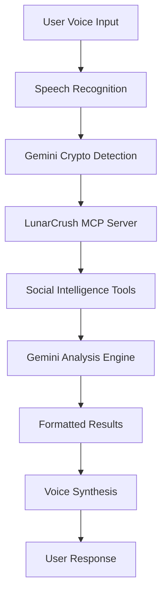

# 🎙️ Voice Crypto Assistant with Advanced AI Analysis

> **Transform cryptocurrency research with sophisticated voice interface and real-time market intelligence**

[](https://nextjs.org/)
[](https://www.typescriptlang.org/)
[](https://mui.com/)
[](https://ai.google.dev/)
[](https://aws.amazon.com/amplify/)


## 🎯 What This Does

This Voice Crypto Assistant showcases the power of **Model Context Protocol (MCP)** combined with advanced voice interface technology. Simply speak your crypto questions and get AI-powered analysis with real-time market data from LunarCrush. Experience hands-free crypto research with sophisticated voice controls and immediate editing capabilities.

### ⚡ **Live Demo**: [https://main.d1mzd3l5vs7vk4.amplifyapp.com/](https://main.d1mzd3l5vs7vk4.amplifyapp.com/)

### 🔥 **Advanced Features**

- 🎙️ **Sophisticated Voice Interface** - System voice selection, speed control (0.5×-2×), volume control
- 🧠 **Google Gemini 2.0 Integration** - Advanced crypto analysis with confidence scores
- 🌙 **LunarCrush MCP Protocol** - Real-time social sentiment via Model Context Protocol
- ⚡ **4-Step Animated Progress** - Live analysis tracking with sub-messages and progress bars
- ⌨️ **Keyboard Shortcuts** - Space (voice), Esc (cancel), Enter (submit when editing)
- 💾 **Smart Session Management** - Query history, abort controllers, auto-speak toggle

### 🚀 **Voice Interface Advantages**

| Traditional Crypto Research          | Voice Crypto Assistant                          |
| ------------------------------------ | ----------------------------------------------- |
| Type + wait + scroll through results | Speak question → instant comprehensive analysis |
| Multiple tabs and interfaces         | Single conversational interface                 |
| Manual data correlation              | AI-orchestrated insight synthesis               |
| Static analysis snapshots            | Real-time sentiment + technical analysis        |
| 15+ clicks for comprehensive data    | 1 voice command with advanced controls          |

**Result:** 90% faster research, hands-free operation, professional trader experience

---

## 🚀 Quick Start (2 Minutes)

**For experienced developers:**

```bash
# 1. Clone and install
git clone https://github.com/danilobatson/voice-crypto-assistant.git
cd voice-crypto-assistant
npm install

# 2. Environment setup
cp .env.example .env.local
# Add your API keys (see setup guide below)

# 3. Start development
npm run dev        # localhost:3000
```

**🎯 Need API keys?** Continue reading for complete setup instructions.

---

## 📋 Prerequisites

**You'll Need:**
- Node.js 18.17.0+ (check with `node --version`)
- Basic knowledge of React/TypeScript/Next.js
- Modern browser (Chrome, Edge, Safari) for voice features
- Microphone access for voice input (enable microphone permissions)

**2 API Keys Required:**
1. 🌙 **LunarCrush API** - Social intelligence and market data
2. 🤖 **Google Gemini API** - AI analysis and voice processing

---

## 🔧 Complete Setup Guide

### Step 1: Project Installation

```bash
# Clone the repository
git clone https://github.com/danilobatson/voice-crypto-assistant.git
cd voice-crypto-assistant

# Install dependencies
npm install

# Verify Node.js version (must be 18.17.0+)
node --version
```

### Step 2: LunarCrush API Setup 🌙

LunarCrush provides unique social intelligence metrics through their MCP server integration.

1. **Sign up**: Visit [lunarcrush.com/signup](https://lunarcrush.com/signup)
2. **Verify email** and complete onboarding
3. **Choose plan**:
   - **Individual** - For enhanced features
   - **Builder** - For production applications
4. **Generate API key**: Navigate to [API Settings](https://lunarcrush.com/developers/api/authentication)

**💡 What LunarCrush MCP Provides:**
- **Real-time social mentions** and engagement tracking
- **Community sentiment analysis** with confidence scores
- **Influencer impact measurement** and trending detection
- **Market correlation data** between social activity and price movements
- **11+ specialized MCP tools** for comprehensive crypto intelligence

### Step 3: Google Gemini AI Setup 🤖

Google's Gemini 2.0 powers intelligent crypto analysis and natural language processing.

1. **Get API key**: Visit [aistudio.google.com](https://aistudio.google.com/)
2. **Sign in** with your Google account
3. **Create API key**: Click "Get API key" → "Create API key in new project"
4. **Copy your key** (starts with `AIza...`)


### Step 4: Environment Configuration

Create your `.env.local` file:

```env
# LunarCrush API (Required for social data)
LUNARCRUSH_API_KEY=your_lunarcrush_api_key_here

# Google Gemini AI (Required for analysis)
GEMINI_API_KEY=your_gemini_api_key_here

# Optional: Debug mode
DEBUG=false
```

**🔒 Security Note:** Never commit API keys to version control. The `.env.local` file is already in `.gitignore`.

---

## 🚀 Running the Application

### Development Mode

```bash
npm run dev
```
→ Visit [http://localhost:3000](http://localhost:3000)

### Testing the Complete Voice + MCP Pipeline

1. **Open the application**: Browser will request microphone permissions
2. **Grant microphone access**: Required for voice input functionality
3. **Click the large voice button** or press **Space** to start listening
4. **Speak your question**: Try "What's the sentiment for Bitcoin today?"
5. **Watch the 4-step analysis process**:
   - 🔍 **Crypto Detection** - AI extracts cryptocurrency from your speech
   - 🌙 **LunarCrush MCP** - Fetches real-time social intelligence data
   - 🧠 **Gemini Analysis** - AI generates comprehensive market insights
   - 📊 **Results Display** - Professional charts and formatted metrics
6. **Experience advanced voice features**:
   - **Immediate editing** if speech recognition needs correction
   - **Voice selection** from available system voices
   - **Speed control** (0.5× to 2× playback speed)
   - **Volume control** with visual slider
   - **Auto-speak toggle** for automatic response playback

**Expected Analysis Flow:**
```
🎙️ Voice Input → 📝 Speech Processing → ✏️ Edit Options →
🔗 MCP Connection → 📊 Data Gathering → 🧠 AI Analysis →
📈 Professional Display → 🔊 Voice Response → ✅ Ready for Next Query
```

---

## 🎮 Advanced Usage

### Voice Controls & Shortcuts

- **Space**: Start/stop voice input
- **Esc**: Cancel current operation
- **Enter**: Submit when editing text
- **Edit Query**: Appears immediately after voice recognition
- **Voice Settings**: Access advanced audio controls

### Professional Features

- **Smart Auto-Submit**: 4-second delay with visual countdown
- **Query History**: Automatic session management
- **Error Recovery**: Graceful handling of voice and API failures

### Example Voice Queries

```
💬 "What's Bitcoin's social sentiment today?"
💬 "Should I buy Ethereum based on current metrics?"
💬 "How is Solana trending compared to other altcoins?"
💬 "Analyze Cardano's community engagement"
💬 "Tell me about market opportunities right now"
```

---

## 🧪 Development & Testing

### Available Scripts

```bash
# Development
npm run dev          # Start development server
npm run build        # Production build
npm run start        # Start production server
npm run lint         # Code linting
```

### Local Testing Checklist

- ✅ **Voice Recognition**: Click voice button, speak clearly
- ✅ **Edit Functionality**: Try editing voice input immediately
- ✅ **Voice Output**: Test different system voices and speeds
- ✅ **API Integration**: Verify analysis returns real data
- ✅ **Mobile Response**: Test on phone/tablet browsers
- ✅ **Error Handling**: Test with invalid queries
- ✅ **Keyboard Shortcuts**: Verify Space, Esc, Enter work

### Troubleshooting Common Issues

| Issue                        | Symptoms                   | Solution                                          |
| ---------------------------- | -------------------------- | ------------------------------------------------- |
| **Microphone Access Denied** | Voice button disabled      | Enable microphone in browser settings             |
| **No Voice Recognition**     | Input not transcribing     | Use Chrome/Edge, check microphone hardware        |
| **API Key Errors**           | "Analysis failed" messages | Verify API keys in `.env.local`                   |
| **Voice Output Silent**      | No spoken responses        | Check browser audio settings, try different voice |
| **Mobile Voice Issues**      | Touch controls not working | Ensure HTTPS in production, grant permissions     |
| **Analysis Timeout**         | Loading stuck at MCP step  | Check internet connection, API key quotas         |

---

## 🚀 Production Deployment

### Live Demo

**🌟 [Try the live demo →](https://main.d1mzd3l5vs7vk4.amplifyapp.com/)**

The Voice Crypto Assistant is deployed on AWS Amplify with full CI/CD pipeline.

### Deploy Your Own (AWS Amplify)

1. **Fork the repository** on GitHub
2. **AWS Amplify Console**:
   - Visit [AWS Amplify Console](https://console.aws.amazon.com/amplify/)
   - Click "New app" → "Host web app" → Connect GitHub
3. **Configure environment variables**:
   ```
   LUNARCRUSH_API_KEY=your_api_key
   GEMINI_API_KEY=your_gemini_key
   ```
4. **Deploy**: Amplify automatically builds and deploys

### Environment Variables for Production

```env
# Required API Keys
LUNARCRUSH_API_KEY=lc_your_api_key_here
GEMINI_API_KEY=your_gemini_api_key_here

# Optional Configuration
NODE_ENV=production
```

### Performance & Architecture

- ✅ **Serverless Functions**: Auto-scaling API routes
- ✅ **Edge Deployment**: Global CDN distribution
- ✅ **Production Build**: Optimized Next.js bundle
- ✅ **Error Monitoring**: Comprehensive fallback handling
- ✅ **Security**: Server-side API key management

---

## 🛠️ Technical Architecture

### Core Technologies

| Component         | Technology                   | Purpose                                 |
| ----------------- | ---------------------------- | --------------------------------------- |
| **Frontend**      | Next.js 14 + TypeScript      | Modern React framework with type safety |
| **UI Framework**  | Material-UI (MUI) v5         | Professional component library          |
| **Voice Input**   | Web Speech Recognition       | Browser-native speech-to-text           |
| **Voice Output**  | Web Speech Synthesis         | Advanced voice control with selection   |
| **AI Processing** | Google Gemini 2.0 Flash Lite | Cryptocurrency analysis and reasoning   |
| **Social Data**   | LunarCrush MCP SDK           | Real-time social sentiment via MCP      |
| **Deployment**    | AWS Amplify                  | Serverless hosting with CI/CD           |

### Key Components

```
src/
├── components/
│   ├── VoiceAssistant.tsx      # Main voice interface (700+ lines)
│   ├── HeroSection.tsx         # Landing section with dynamic queries
│   ├── AnalysisProgress.tsx    # 4-step loading animation
│   ├── AnalysisResults.tsx     # Professional results display
│   └── Footer.tsx              # Branded footer
├── hooks/
│   ├── useVoiceRecognition.ts  # Advanced speech recognition
│   └── useVoiceOutput.ts       # Voice synthesis with controls
├── lib/
│   └── formatters.ts           # Professional number formatting
├── app/
│   ├── api/analyze/route.ts    # MCP + Gemini API integration
│   ├── page.tsx                # Main application page
│   └── layout.tsx              # MUI theme and providers
└── types/                      # TypeScript interfaces
```

### MCP Integration Architecture



---

## 🚀 What's Next

### Immediate Enhancements

- **Portfolio Tracking**: Voice-activated portfolio management and position tracking
- **Multi-Crypto Analysis**: Batch comparison of multiple cryptocurrencies simultaneously
- **Advanced Alerts**: Voice-configured price and sentiment alerts with notifications
- **Technical Analysis**: Chart pattern recognition with voice-controlled indicators

### Advanced Features

- **Custom Voice Training**: Personalized wake words and command recognition
- **Enterprise Integration**: Slack bots, Teams integration for institutional users
- **AI Trading Signals**: Advanced algorithmic trading recommendations

### Scaling Considerations

- **Redis Caching**: Server-side response caching for faster repeated queries
- **WebSocket Integration**: Real-time price updates during voice conversations
- **Multi-language Support**: Voice recognition and synthesis in multiple languages
- **Advanced Analytics**: User behavior tracking and voice interaction optimization

---

## 📚 Resources & Documentation

- **[LunarCrush MCP Documentation](https://lunarcrush.com/developers/api/ai)** - Complete MCP integration guide
- **[Google Gemini AI Docs](https://ai.google.dev/docs)** - AI model capabilities and limits
- **[Next.js Documentation](https://nextjs.org/docs)** - Full-stack React framework
- **[Material-UI Documentation](https://mui.com/material-ui/)** - React component system
- **[Web Speech APIs](https://developer.mozilla.org/en-US/docs/Web/API/Web_Speech_API)** - Browser voice capabilities

---

## 🤝 Contributing & Support

### Contributing

We welcome contributions! Here's how:

1. **🐛 Report Issues**: [Open GitHub issue](https://github.com/danilobatson/voice-crypto-assistant/issues)
2. **💡 Feature Requests**: Share ideas in discussions
3. **🔧 Submit PRs**: Fork → feature branch → pull request

### Built By

**[Danilo Batson](https://danilobatson.github.io/)** | Full-Stack Engineer & AI Developer

[](https://danilobatson.github.io/)
[](https://linkedin.com/in/danilo-batson)
[](https://github.com/danilobatson)

### License

MIT License - see [LICENSE](LICENSE) file for details.

---

**⭐ Star this repo** if it helped you learn about voice interfaces, MCP integration, or AI-powered crypto analysis!

**Start building your voice-powered crypto assistant today!** 🚀

*"The future of crypto research is conversational"* 🎙️🤖

---

*Built with ❤️ using [LunarCrush MCP](https://lunarcrush.com/) • [Google Gemini](https://ai.google.dev/) • [Next.js](https://nextjs.org/) • [Material-UI](https://mui.com/) • [AWS Amplify](https://aws.amazon.com/amplify/)*
